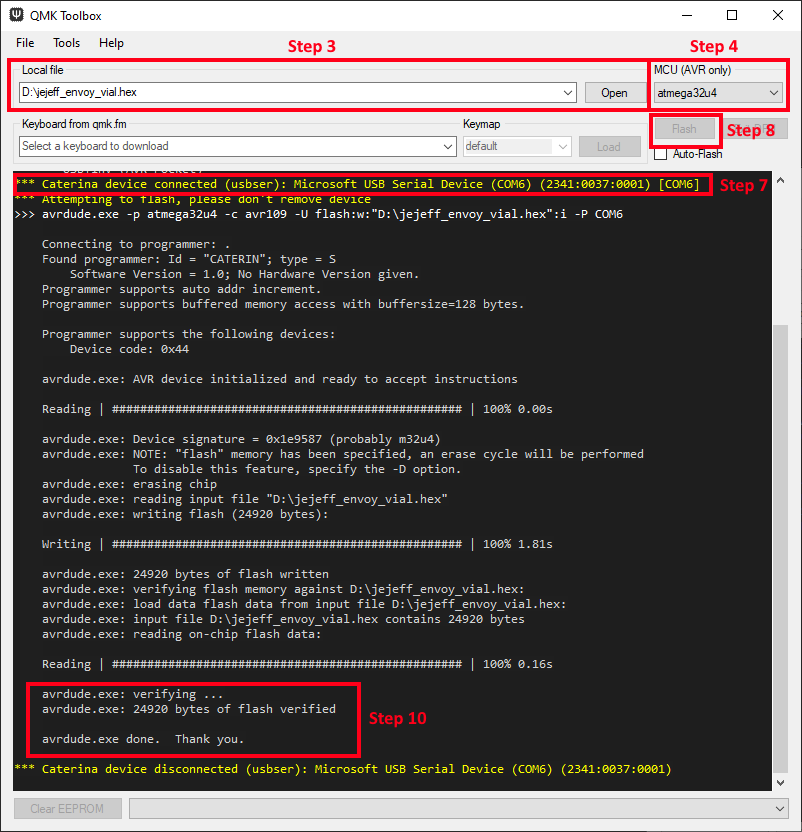

### Envoy Firmware Flashing Guide
Use [QMK Toolbox](https://github.com/qmk/qmk_toolbox/releases) to flash the firmware.

1. Download the [recommended vial firmware here](https://github.com/JeJeff/Envoy/raw/main/Firmware/jejeff_envoy_vial.hex). 
2. Open the QMK Toolbox application.
3. Under 'local file' select the downloaded jejeff_envoy_vial.hex file.
4. Set the MCU field to 'atmega32u4'.
5. Connect your the Pro Micro to your computer using USB.  You may need to wait whilst your operating system installs drivers.
6. Short the two 'reset' pins on the rounded corner of the PCB.  You could use tweezers, or a short length of wire.
7. You should see the yellow text similar to ```*** Caterina device connected (usbser): Microsoft USB Serial Device (COM6) (2341:0037:0001) [COM6]``` appear
8. Click the 'Flash' button within 8 seconds.
9. Wait as QMK Toolbox reads the Pro Micro, writes the new firmware, then verifies it was successful.
10. Near the bottom you should get confirmation that it was verified successfully:
```
    avrdude.exe: verifying ...
    avrdude.exe: 24920 bytes of flash verified
    
    avrdude.exe done.  Thank you.
```
11. Your Envoy macro pad is now ready to be configured in [Vial](https://get.vial.today/).


